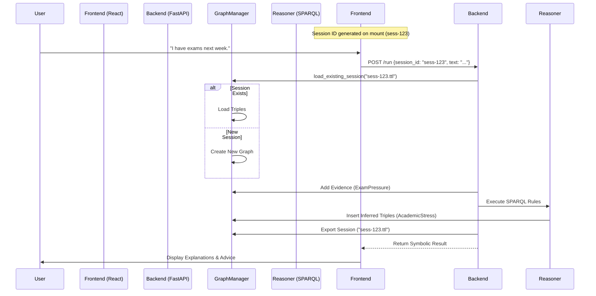

# Session Flow Strategy

## Goal
Ensure multi-turn context preservation and deterministic reasoning across a user session.

## Flow Diagram

## Persistence Logic

1.  **Local Storage (Server)**: 
    - Sessions are stored as `.ttl` (Turtle) files in `data/session_graphs/`.
    - Filename: `{session_id}.ttl`.
    - This ensures that if the server restarts, or if a user reconnects with the same ID, the graph state is recovered.

2.  **Client State**:
    - Frontend holds `session_id` in React state.
    - If page refresh occurs, session is currently reset (simplification for MVP). 
    - *Future Upgrades*: Store `session_id` in `localStorage` to resume exact conversations.

## Constraints Preserved
- **No Numeric State**: State is purely RDF triples.
- **Auditability**: Every turn saves the full graph state.
